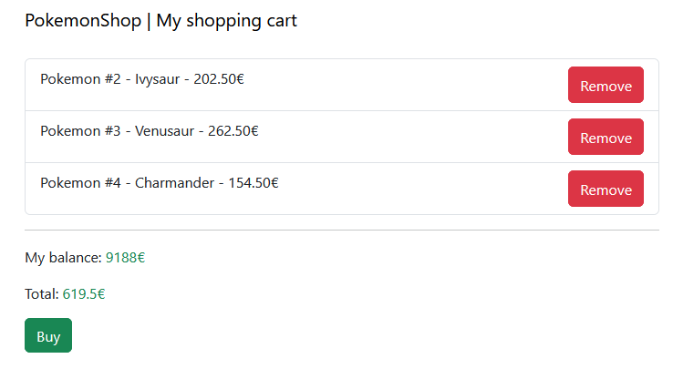
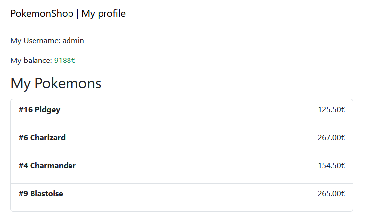

# :frog: PokemonShop

A simple Pokemon online shop created with plain HTML and JavaScript to practice, mainly, the Model-View-Controller pattern and the HTTP requests, using Google Firebase to keep persistence in the data
and getting information from the official Pokemon API.

This project was developed as homework for Client-side Development subject of my Web Application Development formation.

## :wrench: Technologies

- `HTML`
- `CSS`
- `Bootstrap 5`
- `JavaScript`
- `JQuery`
- `Firebase`
- `npm`

## :star: Features

1. **Create your account** and start with an initial amount of money or return, **login and continue** with the shopping day.
2. **Manage your shopping cart** with the data saved in Firebase to keep persistence.
3. **Watch the quantity of Pokemons** obtained via HTTP requests to the Pokemon API.

## :book: What I learned

### Basics of user authentication and persistence in Firebase

I created my very first system of creating tokens for the user and keep authenticated in the website while all his data keeps persistent in the Google Firestore,
a NoSql cloud database that stores the data in documents organized into collections.

### What is a NoSql database

I learned how works a NoSql database like Google Firestore and get knowledge about how flexible it is and its limitations.

### How important is keep a good code structure

Personally with the development of this project, I feel overwhelmed with the code quantity (thinking in my 2024 developer level) and later I appreciate more how a good structure and architectural
pattern can help you clarifying the development process.

### Understand the `async/await` functions

In this project I used very often asynchronous functions that helps me to understand it better, while I executed API requests and also I sent information to the Firestore.

### Implements Javascript's event listeners

I used very often custom callbacks for event listeners, allowing me to create dynamic features like the name/type filter for Pokemons or the multiple selection across the products gallery.

## :eyes: Demostration

*Main page*

*Shopping cart*

*Personal profile*

## :question: How run this app?

1. Download the latest release or clone the repository.
2. Open it with Visual Studio Code and install [Live Server extension](https://marketplace.visualstudio.com/items?itemName=ritwickdey.LiveServer).
3. Open `src/index.html` with the extension.
4. Welcome to the shop!

